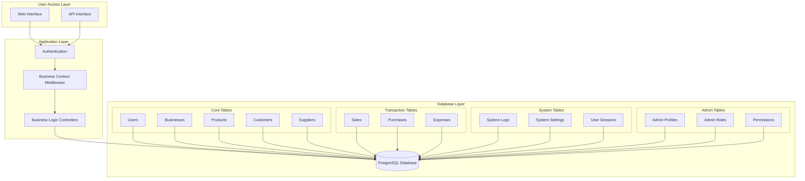
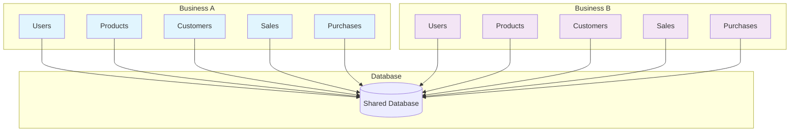
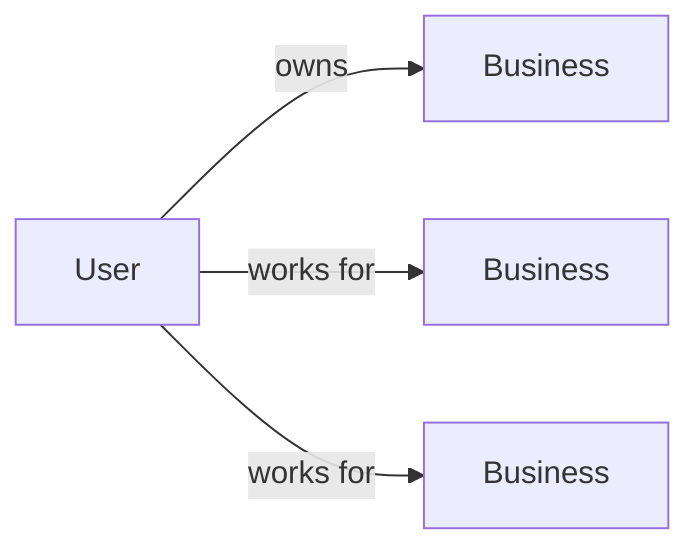
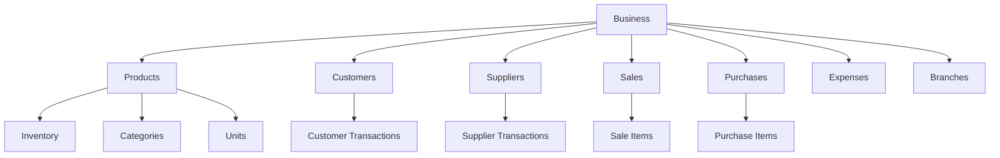
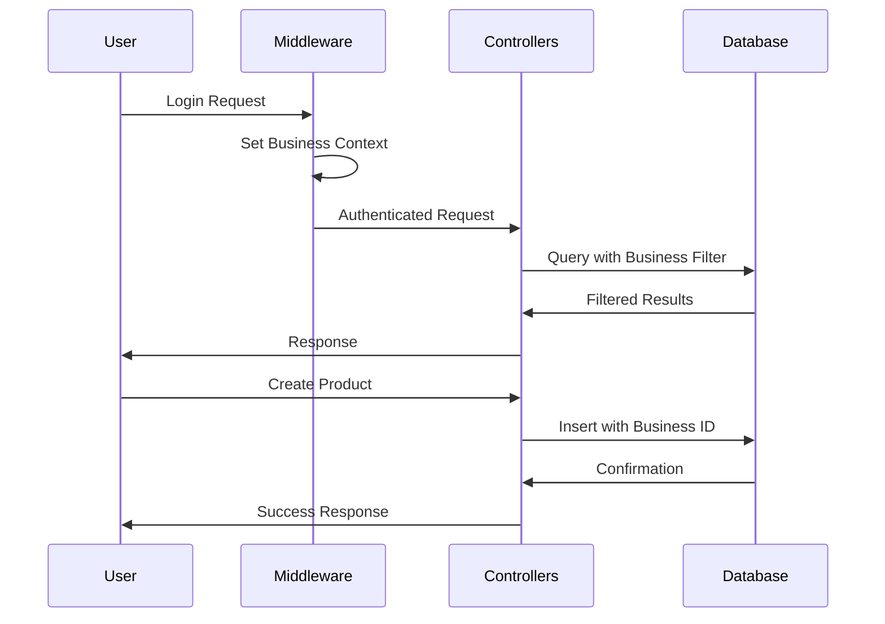
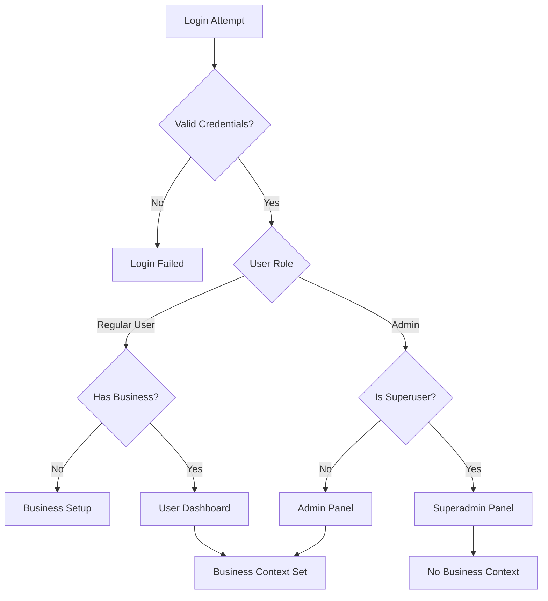
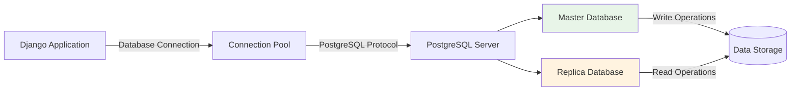
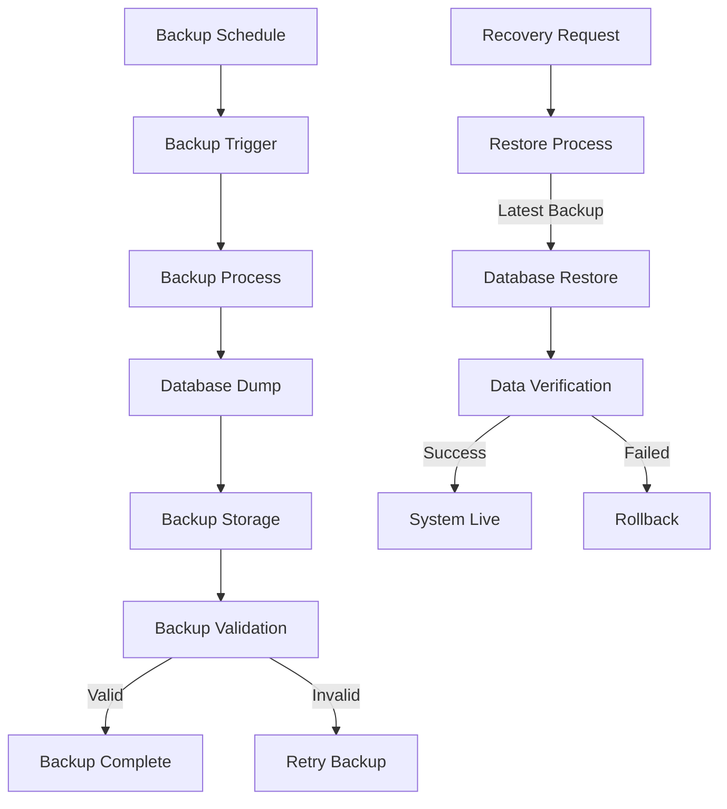

# Database Architecture and Workflow

## System Overview

## Multi-tenancy Data Isolation

## Key Relationships

### User to Business Relationship

### Business Data Hierarchy

## Data Flow Process

## Security and Access Control

## Database Connection and Configuration

## Backup and Recovery Process

