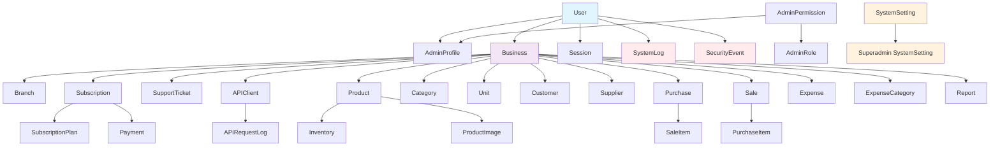

# Database Structure and Relationships

## Overview
This diagram shows the main database structure and relationships in our inventory management system.

## Key Components

### 1. User Management
- **User**: Core user model with authentication details
- **AdminProfile**: Extended profile for admin users
- **AdminRole**: Roles that define user permissions
- **AdminPermission**: Individual permissions that can be assigned to roles

### 2. Business Context (Multi-tenancy)
- **Business**: Main entity that represents a company using the system
- **Branch**: Physical locations of a business
- All other business-specific data is linked to a Business entity

### 3. Product Management
- **Category**: Product categories
- **Unit**: Measurement units
- **Product**: Main product information
- **Inventory**: Stock levels for products
- **ProductImage**: Visual representations of products

### 4. Transaction Management
- **Customer**: Customer information
- **Supplier**: Supplier information
- **Purchase**: Purchase transactions from suppliers
- **Sale**: Sales transactions to customers
- **PurchaseItem**: Individual items in a purchase
- **SaleItem**: Individual items in a sale

### 5. Financial Management
- **Expense**: Business expenses
- **ExpenseCategory**: Categories for expenses

### 6. Subscription & Billing
- **SubscriptionPlan**: Available subscription plans
- **Subscription**: Business subscriptions to plans
- **Payment**: Payment records for subscriptions

### 7. Support & Communication
- **SupportTicket**: Support requests from businesses
- **APIClient**: API clients for business integrations
- **APIRequestLog**: Logs of API requests

### 8. System Management
- **SystemLog**: General system activity logs
- **SecurityEvent**: Security-related events
- **SystemSetting**: System-wide configuration settings
- **Report**: Generated reports

## Multi-tenancy Implementation

The system implements multi-tenancy by associating most data models with a Business entity:
- Each business has its own isolated data
- Users can belong to multiple businesses
- Data access is filtered by the current business context
- Business owners have full access to their business data

## Access Control

1. **Regular Users**: Access only data associated with their business
2. **Admin Users**: Access to admin system with role-based permissions
3. **Superadmins**: Full access to all businesses and system management features

## Data Flow

1. User authentication establishes session
2. Business context is set for the session
3. All database queries are filtered by business context
4. Admin/superadmin access bypasses business context for system management
5. Logs and security events track all system activity