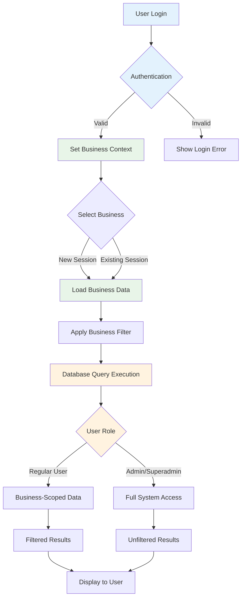
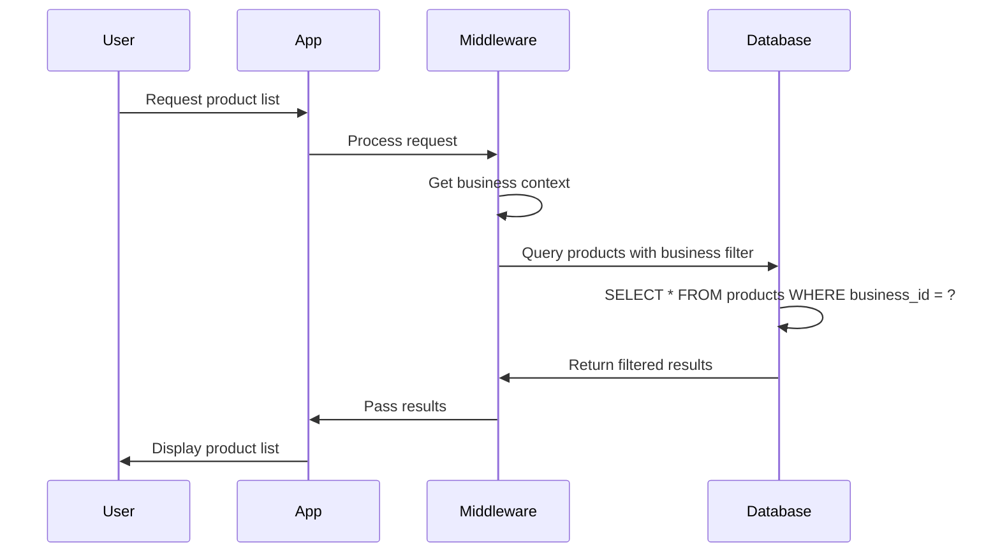

# How the Database Works in Our System

## Core Concept: Multi-tenancy with Business Isolation

Our system uses a shared database with isolated business data. Each business operates in its own "sandbox" within the same database.

## Database Workflow Diagram



## Key Database Components

### 1. User Management System
```
Users Table
├── Authentication credentials
├── Personal information
├── Role assignments
└── Business associations

Admin Profiles Table
├── Extended admin information
├── Role assignments
└── Permission mappings
```

### 2. Business Context System
```
Businesses Table
├── Company information
├── Owner (User foreign key)
├── Subscription details
└── Status information

Branches Table
├── Business foreign key
├── Location details
└── Contact information
```

### 3. Core Business Data
```
Products Table
├── Business foreign key
├── Category foreign key
├── Unit foreign key
├── Pricing information
└── Stock levels

Customers Table
├── Business foreign key
├── Contact details
└── Transaction history

Suppliers Table
├── Business foreign key
├── Contact details
└── Product relationships
```

### 4. Transaction System
```
Sales Table
├── Business foreign key
├── Customer foreign key
├── User foreign key
├── Timestamp
└── Total amount

Sale Items Table
├── Sale foreign key
├── Product foreign key
├── Quantity
├── Price
└── Discount

Purchases Table
├── Business foreign key
├── Supplier foreign key
├── User foreign key
├── Timestamp
└── Total amount

Purchase Items Table
├── Purchase foreign key
├── Product foreign key
├── Quantity
├── Cost
└── Price
```

### 5. Financial Tracking
```
Expenses Table
├── Business foreign key
├── Category foreign key
├── User foreign key
├── Amount
├── Description
└── Date

Expense Categories Table
├── Business foreign key
├── Name
└── Description
```

### 6. System Management
```
System Logs Table
├── User foreign key (nullable)
├── Log level
├── Message
├── IP address
└── Timestamp

Security Events Table
├── User foreign key (nullable)
├── Event type
├── Details
├── IP address
└── Timestamp

System Settings Table
├── Key
├── Value
└── Description
```

## Data Isolation Process

### 1. User Authentication
When a user logs in:
1. Credentials are verified against the Users table
2. If valid, the system checks the user's business associations
3. User is prompted to select a business if they have multiple

### 2. Business Context Setting
Once a business is selected:
1. The business ID is stored in the user's session
2. Middleware applies this context to all subsequent requests
3. All database queries are automatically filtered by business ID

### 3. Query Execution with Filtering
For every database query:
1. The system checks the current user's business context
2. Adds a WHERE clause to filter by business_id
3. Executes the query with business isolation

Example:
```sql
-- Without business context
SELECT * FROM products;

-- With business context (automatically applied)
SELECT * FROM products WHERE business_id = 123;
```

## Access Control Levels

### Regular Users
- Can only access data from their selected business
- Queries automatically filtered by business context
- Cannot access admin or system functions

### Admin Users
- Access to admin panel with role-based permissions
- Can manage users and settings within their business
- Cannot access other businesses' data

### Superadmins
- Full access to all system features
- Can manage all businesses
- Can view system logs and security events
- Can access system-wide settings

## Data Flow Example



## Key Features

1. **Automatic Filtering**: All queries are automatically filtered by business context
2. **Data Isolation**: Businesses cannot access each other's data
3. **Role-Based Access**: Different user types have different levels of access
4. **Audit Trail**: All actions are logged for security and compliance
5. **Scalability**: Shared database design allows for efficient resource usage
6. **Performance**: Indexes on business_id columns for fast filtering

This architecture ensures that each business operates in a secure, isolated environment while sharing infrastructure resources efficiently.